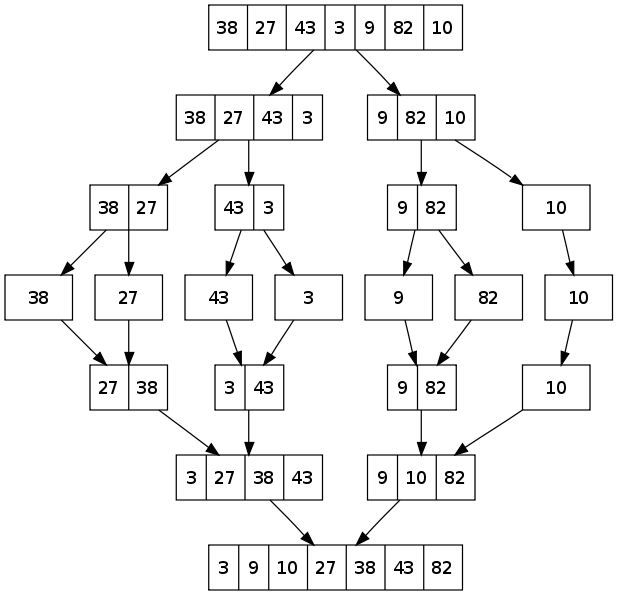

# Complexity:

Big O notation: Relation between N and time taken

## Examples:

```c++
for(i=0;i<N;i++)
{
	a=a+j;
}
```
Complexity: Order of N {written ad O(N)}, as time taken is linearly proportional to N

```c++
for(j=0;j<N;j++)
	for(i=0;i<N;i++)
	{
		a=a+j+i;
	}
```
Complexity: O(N^2), as time taken is proportional to the square of N (Number of iterations = N^2).

```c++
int a=0,i=N;
while(i>0)
{
	a+=i;
	i/=2;
}
```
Complexity: O(log(N)), as number of iterations is proportional to log(N)


# Sorting Algorithms

## Insertion sort

```c++
for(int j=1;j<n;j++)
{
	key=A[j];
	i=j-1;
	while(i>=0 && A[i]>key)
	{
		A[i+1] = A[i]
		i=i-1;
	}
	A[i+1]=key;
}
```

## Merge sort:
Divide, conquer, combine

```
If r > l
     1. Find the middle point to divide the array into two halves:  
             middle m = (l+r)/2
     2. Call mergeSort for first half:   
             Call mergeSort(arr, l, m)
     3. Call mergeSort for second half:
             Call mergeSort(arr, m+1, r)
     4. Merge the two halves sorted in step 2 and 3:
             Call merge(arr, l, m, r)
```

C++ code:
```c++
// Merges two subarrays of arr[].
// First subarray is arr[l..m]
// Second subarray is arr[m+1..r]
void merge(int arr[], int l, int m, int r)
{
    int i, j, k;
    int n1 = m - l + 1;
    int n2 =  r - m;
 
    /* create temp arrays */
    int L[n1], R[n2];
 
    /* Copy data to temp arrays L[] and R[] */
    for (i = 0; i < n1; i++)
        L[i] = arr[l + i];
    for (j = 0; j < n2; j++)
        R[j] = arr[m + 1+ j];
 
    /* Merge the temp arrays back into arr[l..r]*/
    i = 0; // Initial index of first subarray
    j = 0; // Initial index of second subarray
    k = l; // Initial index of merged subarray
    while (i < n1 && j < n2)
    {
        if (L[i] <= R[j])
        {
            arr[k] = L[i];
            i++;
        }
        else
        {
            arr[k] = R[j];
            j++;
        }
        k++;
    }
 
    /* Copy the remaining elements of L[], if there
       are any */
    while (i < n1)
    {
        arr[k] = L[i];
        i++;
        k++;
    }
 
    /* Copy the remaining elements of R[], if there
       are any */
    while (j < n2)
    {
        arr[k] = R[j];
        j++;
        k++;
    }
}
 
/* l is for left index and r is right index of the
   sub-array of arr to be sorted */
void mergeSort(int arr[], int l, int r)
{
    if (l < r)
    {
        // Same as (l+r)/2, but avoids overflow for
        // large l and h
        int m = l+(r-l)/2;
 
        // Sort first and second halves
        mergeSort(arr, l, m);
        mergeSort(arr, m+1, r);
 
        merge(arr, l, m, r);
    }
}
 
/* UTILITY FUNCTIONS */
/* Function to print an array */
void printArray(int A[], int size)
{
    int i;
    for (i=0; i < size; i++)
        printf("%d ", A[i]);
    printf("\n");
}
 
/* Driver program to test above functions */
int main()
{
    int arr[] = {12, 11, 13, 5, 6, 7};
    int arr_size = sizeof(arr)/sizeof(arr[0]);
 
    printf("Given array is \n");
    printArray(arr, arr_size);
 
    mergeSort(arr, 0, arr_size - 1);
 
    printf("\nSorted array is \n");
    printArray(arr, arr_size);
    return 0;
```

# Search Algorithms

## Binary search
log(N) search algorithm


```c++
#include <stdio.h>
 
// A recursive binary search function. It returns location of x in
// given array arr[l..r] is present, otherwise -1
int binarySearch(int arr[], int l, int r, int x)
{
   if (r >= l)
   {
        int mid = l + (r - l)/2;
 
        // If the element is present at the middle itself
        if (arr[mid] == x)  return mid;
 
        // If element is smaller than mid, then it can only be present
        // in left subarray
        if (arr[mid] > x) return binarySearch(arr, l, mid-1, x);
 
        // Else the element can only be present in right subarray
        return binarySearch(arr, mid+1, r, x);
   }
 
   // We reach here when element is not present in array
   return -1;
}
 
int main(void)
{
   int arr[] = {2, 3, 4, 10, 40};
   int n = sizeof(arr)/ sizeof(arr[0]);
   int x = 10;
   int result = binarySearch(arr, 0, n-1, x);
   (result == -1)? printf("Element is not present in array")
                 : printf("Element is present at index %d", result);
   return 0;
}
```